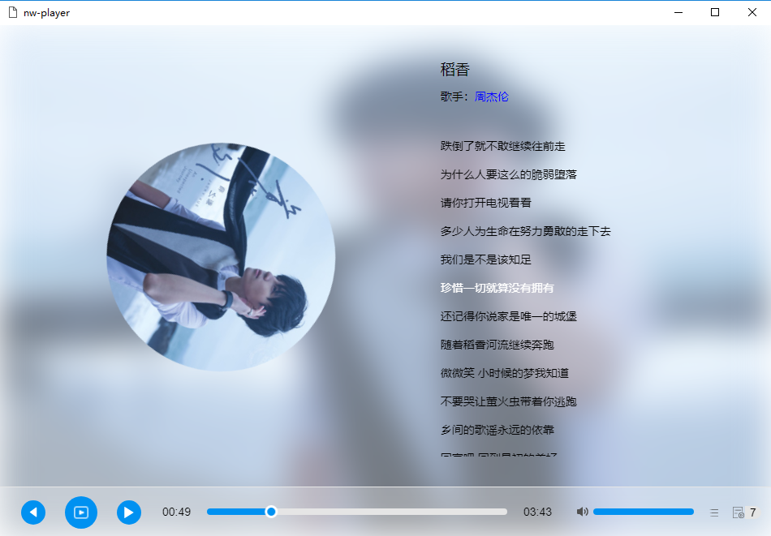

# LrcSync.js

> A JavaScript for synchronizing LRC files and exporting useful lyrics API

## Installation

```
npm install lyricsync --save

const lyric = new LrcSync(lrc, lrcHandler)
```

## API

`play()`

`toggle()`

`stop()`

`linkTo()`

## Example
